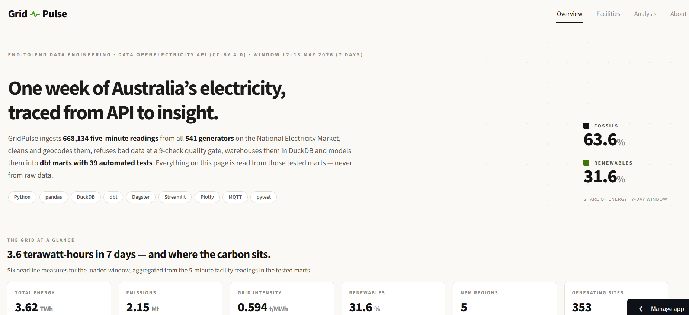
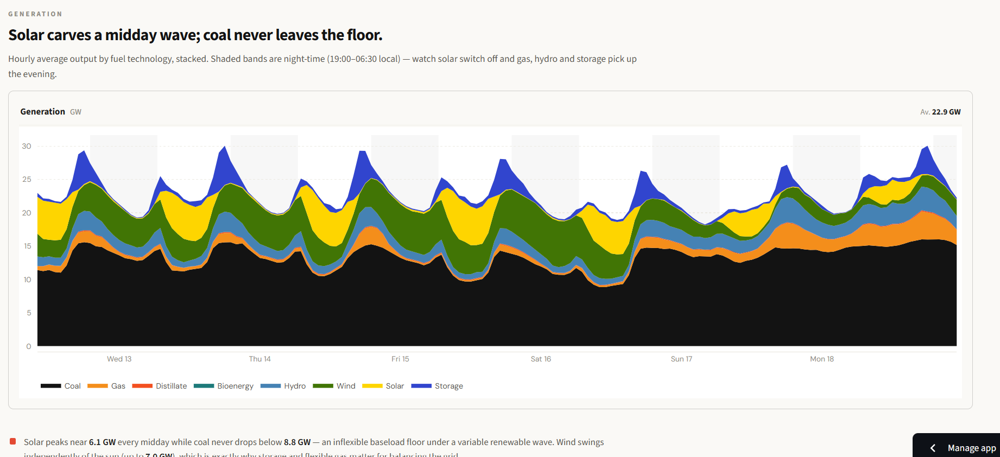
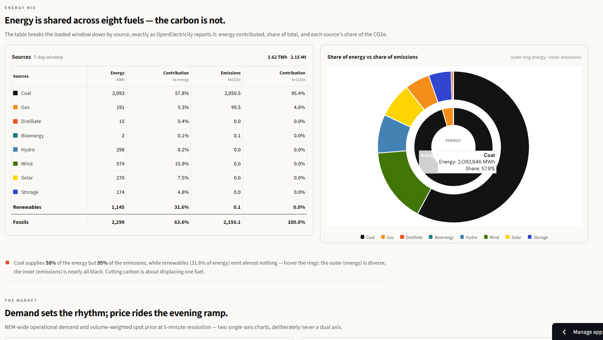
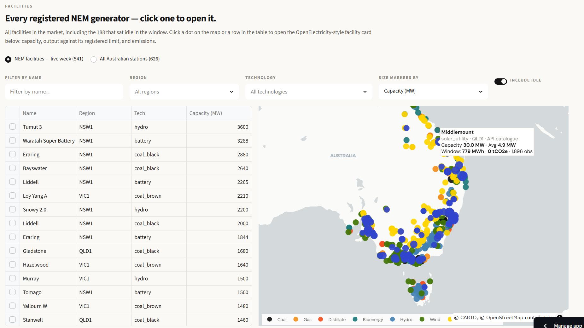
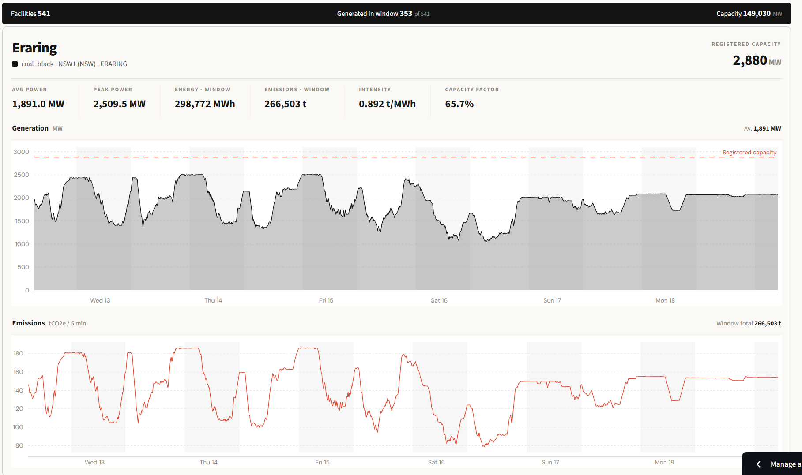
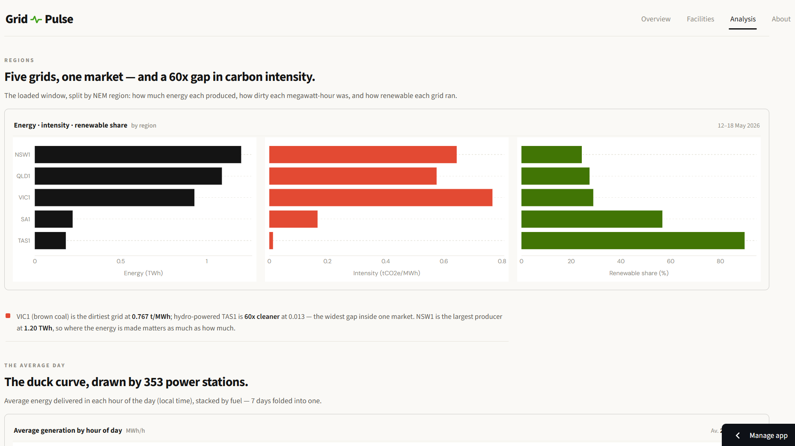
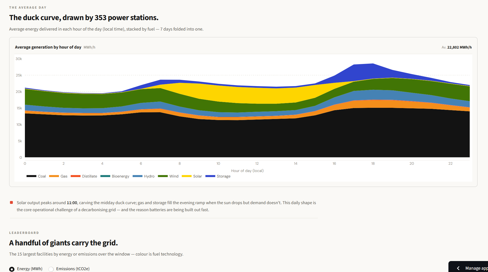

# GridPulse

**An end-to-end data-engineering pipeline for Australia's National Electricity Market (NEM) — from raw API to a live analytics dashboard.**

> ### 🔗 Live dashboard → **https://gridpulse-nem-analytics.streamlit.app/**

Australia's electricity market publishes a firehose of data — every generator, every five
minutes — but the raw feed is a rate-limited API of long-format JSON, not an answer. GridPulse
turns one week of that feed into a governed, tested analytical warehouse and a dashboard that
answers the questions that actually matter: *where does the power come from, where does the
carbon come from, and why are those two not the same place?*

It ingests **668,134 five-minute readings** from **541 registered facilities** (353 of which
generated during the window), cleans and geocodes them, gates them through a 9-check quality
layer, warehouses them in **DuckDB**, models them into tested **dbt marts**, and serves them
through a live map and an analytics dashboard — the whole thing an orchestrated **Dagster**
asset graph that **replays offline with no API key**.

> Built from a COMP5339 (Data Engineering, University of Sydney) assignment and levelled up into
> a production-shaped project: an installable package, orchestration, a dbt warehouse with data
> tests, a unit-test suite, and a hand-crafted architecture diagram.

---

## The dashboard

Four views, switched from an OpenElectricity-style top navigation. Every number on every page is
read from the **tested dbt marts** — never from raw data.

### 📊 Overview

The week at a glance: a headline energy/emissions split, six KPI tiles (total energy, emissions,
grid intensity, renewable share, NEM regions, generating sites), the full seven-day generation
stack by fuel, and a fuel-mix breakdown that makes the central insight impossible to miss —
**coal supplies ~58% of the energy but ~95% of the emissions.**

### 🗺️ Facilities

Every registered NEM generator on a map (modelled on the OpenElectricity *Facilities* view):
colour = fuel group, marker size = capacity / power / energy / emissions, and hovering shows
**every value** for that facility. Filter by name, region, technology, or toggle in the 188
stations that sat idle during the window. Clicking a marker — or a row in the sortable table —
drills into that facility's five-minute week: output against its registered capacity, plus its
emissions trace.

### 📈 Analysis

The story behind the numbers: energy, carbon intensity and renewable share compared across all
five NEM regions; the diurnal "duck curve" (seven days folded into one average day, showing solar
carving out midday while coal holds a flat baseload floor); and a leaderboard of the 15 facilities
that carry the grid, by energy or by emissions.

### 📄 About

The embedded case study: the architecture diagram plus a stage-by-stage narrative of ingestion,
transformation, quality, modelling, orchestration and serving — so a reviewer can read the whole
pipeline without leaving the app.

Alongside the marts dashboard, the original **live MQTT + Plotly Dash map**
(`Assignment2_Dashboard_Group156.ipynb`) replays the real-time stream: the Dash map answers
*"what's happening now?"*, the Streamlit dashboard answers *"what did the week look like?"*.

---

## Architecture

One command (`python -m gridpulse.pipeline`) reproduces every artefact — ingest, clean, geocode,
quality-gate and load — from a **committed raw-JSON cache**, so the whole warehouse rebuilds
**offline, with no API key**. `dbt build` then models and tests it; Dagster wraps the lot as one
lineage graph with a daily schedule.

Layered storage keeps the API touched **at most once per window**: immutable raw JSON (committed)
→ consolidated CSV → DuckDB schema → dbt marts. See [`docs/ARCHITECTURE.md`](docs/ARCHITECTURE.md)
for detail and [`docs/data_dictionary.md`](docs/data_dictionary.md) for the schema.

**Engineering decisions worth reading:**

- **API hygiene by design.** `OpenElectricityClient` retries **only** transient failures
  (429 / 5xx, honouring `Retry-After`), fails fast on 4xx, tracks a request budget, and batches
  ~25 facility codes per call — so ~430 facilities cost ~18 requests, well under the free-tier
  500/day ceiling.
- **Cache-first, replay-anywhere.** Every raw response is written to disk **before** parsing and
  is committed to the repo. That single materialisation is what lets every downstream stage — and
  every reviewer — rebuild the warehouse offline with no key.
- **Aggregation that respects the physics.** Parallel generating units are summed to facility
  level because power *and* emissions are additive across units (e.g. Bayswater's four coal
  turbines), then pivoted into one wide five-minute contract.
- **Quality gated before load, not after.** A dependency-free "expectations" layer runs **9
  checks** (row count, schema contract, non-null keys, unique `(interval, facility)` grain,
  region domain, in-window timestamps, non-negative emissions, coordinates in range) and stops
  the pipeline on a hard failure — negative *power* is kept on purpose (batteries charging) but
  flagged.
- **Spatial done deterministically.** Coordinates are validated against an Australian bounding
  box and any invalid/missing point is backfilled from its NEM-region centroid (offline, tagged
  `geocode_source`), seeding a DuckDB `GEOMETRY` column.
- **Tested in two layers.** A Python quality gate **and** **39 dbt data tests** (`unique`,
  `not_null`, `relationships`, `accepted_values`, `accepted_range`, plus two custom singular
  tests) guard the marts — data quality is enforced, not assumed.
- **One lineage graph.** The pipeline is a Dagster asset graph from API to marts; a custom
  `DagsterDbtTranslator` maps the four warehouse tables 1:1 onto dbt sources so models always run
  *after* the warehouse loads, and every asset emits row-count / pass-rate metadata.

---

## Verified results (sample week, 12–18 May 2026)

Everything below is reproduced by the marts (`dbt build`, then query DuckDB):

- **668,134** facility-interval rows across **541** registered facilities (**353** generated in
  the window), all **5** NEM regions — **3.62 TWh** of energy, **2.15 Mt** of CO₂e.
- **0 nulls** across the consolidated contract; **9/9** quality-gate checks pass; **39/39** dbt
  tests pass.
- **Emissions concentration:** fossil fuels are **~64%** of energy but **~100%** of emissions —
  coal alone is ~58% of energy and ~95% of the carbon. This is the headline insight.
- **Regional intensity:** NSW1 (1.20 TWh) and QLD1 (1.09 TWh) lead on energy; **VIC1 is the
  dirtiest grid at 0.767 tCO₂e/MWh** on brown coal while **hydro-powered TAS1 is 60× cleaner at
  0.013** — the widest gap inside one market.
- **Diurnal pattern:** solar peaks ~09:00–15:00 (local), carving the midday duck curve, while
  coal never leaves the floor and gas + storage fill the evening ramp.

---

## 📄 Technical report

A full write-up — data sourcing, methodology, the five-stage architecture, data-quality strategy,
dbt modelling, orchestration and results — is available as a rendered
**[PDF](GridPulse_Report.pdf)**, generated from the LaTeX source
**[`report/gridpulse.tex`](report/gridpulse.tex)** with figures in
[`report/fig/`](report/fig).

---

## Tech stack

**Python 3.12 · DuckDB · dbt (dbt-duckdb) · Dagster · pandas · Streamlit · Plotly · MQTT (paho) · Dash · pytest**

---

## Data, scope & limitations

- **Data:** [OpenElectricity](https://openelectricity.org.au/) v4 API, National Electricity
  Market, snapshot window 12–18 May 2026, licensed
  [CC BY 4.0](https://creativecommons.org/licenses/by/4.0/). The raw JSON cache **is** committed
  so the pipeline replays offline; the DuckDB warehouse and consolidated CSV are derived and
  rebuilt by one command.
- Figures are a **snapshot of one seven-day window** for one market — retrain/re-pull per window
  (one command) rather than treating them as long-run averages.
- Reported values are **operational metering** aggregated to five-minute facility intervals, not
  audited settlement data.

## What I'd add next

- Incremental dbt models + DuckDB partitioned Parquet for multi-week history.
- A short-horizon price/emissions **forecast** (XGBoost/Prophet) as a new mart plus a "shift your
  load now?" signal.
- CI (GitHub Actions) running `pytest` + `dbt build` on every push, and scheduled `dagster` runs
  in the cloud.

---

## License

Code is released under the [MIT License](LICENSE). Electricity data is sourced from
[OpenElectricity](https://openelectricity.org.au/) under CC-BY 4.0.

*Authors: Aditya Moon &amp; Pranjal Desai · data originally from OpenElectricity (CC-BY).*
