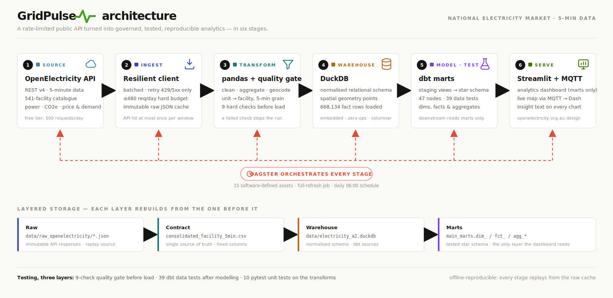

<div align="center">

# GridPulse

**An end-to-end data-engineering pipeline for Australia's National Electricity Market (NEM)**

Ingest 5-minute facility-level power &amp; emissions data, clean and geocode it, load a normalised
analytical schema into DuckDB, transform it into tested dbt marts, and serve it through a live
map and an analytics dashboard — all orchestrated with Dagster.

[](https://www.python.org/)
[](https://duckdb.org/)
[](https://www.getdbt.com/)
[](https://dagster.io/)
[](https://streamlit.io/)
[](#quickstart)
[](LICENSE)

</div>

> Built from a COMP5339 (Data Engineering, University of Sydney) assignment and levelled up
> into a production-shaped project: an installable package, orchestration, a dbt warehouse with
> data tests, a unit-test suite, and a hand-crafted architecture diagram.



---

## Table of contents

- [Why this project](#why-this-project)
- [Verified results](#verified-results-sample-week-1219-may-2026)
- [Architecture at a glance](#architecture-at-a-glance)
- [Quickstart](#quickstart)
- [The dashboard](#the-dashboard)
- [Project structure](#project-structure)
- [Tech stack](#tech-stack)
- [What I'd add next](#what-id-add-next)
- [License](#license)

---

## Why this project

It demonstrates the skills recruiters actually screen for in a data engineer, end to end and
**runnable offline**:

| Capability | How it's shown here |
|------------------------------------|------------------------------------|
| **Ingestion & API hygiene** | `OpenElectricityClient` with selective retries (429/5xx only), `Retry-After` handling, request-budget tracking, and an immutable raw-JSON cache |
| **Transformation** | Unit-to-facility aggregation, metric standardisation, UTC windowing, wide-table consolidation (668k rows) |
| **Geocoding / spatial** | Coordinate validation against an AU bounding box, region-centroid backfill, DuckDB `GEOMETRY` points |
| **Data quality** | A Python "expectations" gate (9 checks) **and** 39 dbt data tests (unique, not_null, relationships, accepted_values/range, custom singular tests) |
| **Modelling** | dbt staging to marts (star-shaped `dim`/`fct` + aggregate marts) on `dbt-duckdb` |
| **Orchestration** | Dagster software-defined assets, one lineage graph from API to marts, a daily schedule, per-run metadata |
| **Serving** | A four-view Streamlit app (KPI overview, a full facility-explorer map with every-value hover & click drill-down, analysis, and a built-in case study of the architecture) plus the original live MQTT/Dash map |
| **Engineering practice** | Installable package, `pyproject.toml`, `Makefile`, pytest suite, `.gitignore`, docs |

---

## Verified results (sample week, 12–19 May 2026)

Everything below is reproduced by the marts (`dbt build`, then query DuckDB):

- **668,134** facility-interval rows across **353** generating facilities, all 5 NEM regions.
- **0 nulls** across the consolidated contract; **9/9** quality checks pass; **47/47** dbt nodes pass.
- **Emissions concentration:** fossil fuels are ~64% of energy but **~100% of emissions** — the headline insight.
- **Regional intensity:** NSW1 1.20 TWh & QLD1 1.09 TWh lead on energy; **VIC1 highest intensity (0.767 tCO2e/MWh)** on brown coal; **TAS1 lowest (0.013)** on hydro.
- **Diurnal pattern:** solar peaks ~09:00–15:00 (local), displacing gas while coal holds a flat baseline.

---

## Architecture at a glance

```
OpenElectricity v4 API
        |   (batched, retried, budget-tracked)
        v
Raw JSON cache  -->  Clean / aggregate / geocode / quality-gate  -->  consolidated CSV (contract)
                                                                          |
                                                                          v
                                                            DuckDB analytical schema (sources)
                                                                          |  dbt
                                                     staging views --> marts (dim / fct / agg_*)
                                                                          |
                                          +-------------------------------+---------------+
                                          v                                               v
                                Streamlit analytics dashboard              live MQTT stream + Dash map
        (the whole pipeline is a Dagster asset graph with a daily schedule)
```

Layered storage keeps the API touched **at most once per window**: immutable raw JSON (committed)
→ consolidated CSV → DuckDB schema → dbt marts. The repo ships the **raw JSON cache**, so the
pipeline rebuilds the CSV and the DuckDB warehouse **offline, with no API key**. See
[`docs/ARCHITECTURE.md`](docs/ARCHITECTURE.md) for detail and
[`docs/data_dictionary.md`](docs/data_dictionary.md) for the schema.

---

## Quickstart

Python **3.12** recommended (dbt-core / Dagster aren't stable on 3.14 yet).

```bash
# 0. clone
git clone https://github.com/adhu-601/gridpulse.git
cd gridpulse

# 1. environment
py -3.12 -m venv .venv
.venv/Scripts/pip install -e ".[orchestration,transform,dashboard,stream,dev]"
.venv/Scripts/dbt deps --project-dir dbt

# 2. run the pipeline (offline, from the committed raw cache) -> builds data/electricity_a2.duckdb
.venv/Scripts/python -m gridpulse.pipeline          # add --fetch to pull new data

# 3. build + test the warehouse
export GRIDPULSE_DUCKDB="$PWD/data/electricity_a2.duckdb"
.venv/Scripts/dbt build --project-dir dbt --profiles-dir dbt

# 4. explore
.venv/Scripts/python -m pytest                       # unit tests
.venv/Scripts/streamlit run dashboard/app_streamlit.py
.venv/Scripts/dagster dev -m orchestration.definitions   # asset graph + runs at localhost:3000
```

`make help` lists the same commands. The DuckDB warehouse (~106 MB) and the consolidated CSV
(~63 MB) are **not** committed — they are derived artefacts that step 2 rebuilds from the raw
JSON cache in seconds.

### The dashboard

`streamlit run dashboard/app_streamlit.py` serves four views on the marts:

1. **Overview** — KPIs, generation vs emissions donuts, the hourly generation stack for the whole week, and NEM price & demand.
2. **Facility explorer** — all **541 facilities** on a map (modelled on the OpenElectricity *Facilities* view): colour = fuel group, size = capacity/power/energy/emissions, and hovering shows **every value** (capacity, avg/peak power, energy, emissions, intensity, capacity factor, observation count). Clicking a marker drills into that facility's 5-minute week; a sortable full table sits underneath.
3. **Analysis** — regional energy & intensity, the diurnal "duck curve", facility leaderboards, intensity by fuel technology.
4. **About** — the case study: the architecture diagram plus a stage-by-stage narrative of ingestion, transformation, quality, modelling, orchestration and serving.

To pull a **fresh** window instead of replaying the cache, set an `OPENELECTRICITY_API_KEY` and
run with `--fetch` (or `GRIDPULSE_FETCH=1` under Dagster).

---

## Project structure

```
gridpulse/                 # installable pipeline package
  config.py                #   paths, API settings, data contract
  api_client.py            #   OpenElectricity client (retries, budget)
  ingest.py                #   raw cache + long-format parsing
  transform.py             #   clean / aggregate / consolidate
  geocode.py               #   coordinate validation + centroid backfill
  quality.py               #   dependency-free data-quality gate
  load.py                  #   DuckDB normalised schema loader
  pipeline.py              #   CLI entrypoint (ingest -> transform -> load)
dbt/                       # dbt-duckdb project
  models/staging/          #   stg_* views (typed, NEM-scoped)
  models/marts/            #   dim_facility, fct_facility_interval, agg_*
  tests/                   #   custom singular data tests
orchestration/             # Dagster
  assets.py                #   ingest -> warehouse software-defined assets
  dbt_assets.py            #   dbt models as Dagster assets (dagster-dbt)
  definitions.py           #   Definitions, job, daily schedule
dashboard/app_streamlit.py # analytics dashboard on the marts
tests/                     # pytest unit suite (transform / quality / geocode)
docs/                      # architecture diagram + data dictionary
data/                      # committed raw JSON cache (offline replay source);
                           #   the DuckDB warehouse + consolidated CSV are rebuilt by the pipeline
# original assignment deliverables kept alongside:
Assignment2_Group156.ipynb, Assignment2_Dashboard_Group156.ipynb, *_report.pdf
```

---

## Tech stack

**Python 3.12 · DuckDB · dbt (dbt-duckdb) · Dagster · pandas · Streamlit · Plotly · MQTT (paho) · Dash · pytest**

---

## What I'd add next

- Incremental dbt models + DuckDB partitioned Parquet for multi-week history.
- A short-horizon price/emissions **forecast** (XGBoost/Prophet) as a new mart plus a "shift your load now?" signal.
- CI (GitHub Actions) running `pytest` + `dbt build` on every push, and scheduled `dagster` runs in the cloud.

---

## License

Code is released under the [MIT License](LICENSE). Electricity data is sourced from
[OpenElectricity](https://openelectricity.org.au/) under CC-BY 4.0.

*Authors: Aditya Moon &amp; Pranjal Desai · data originally from OpenElectricity (CC-BY).*
