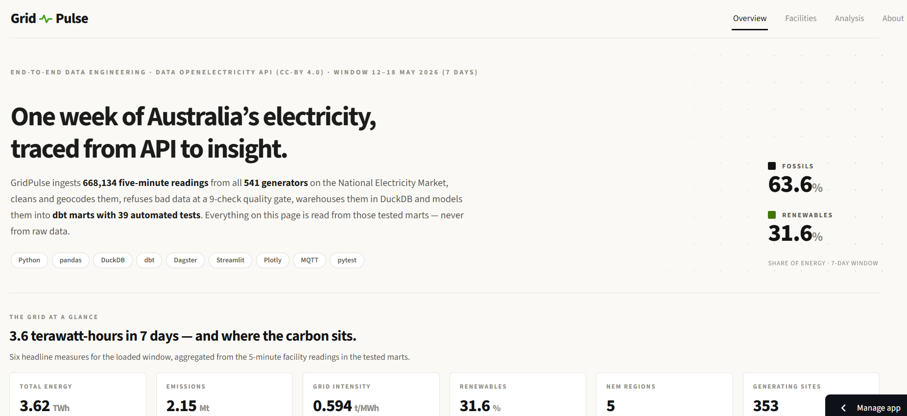
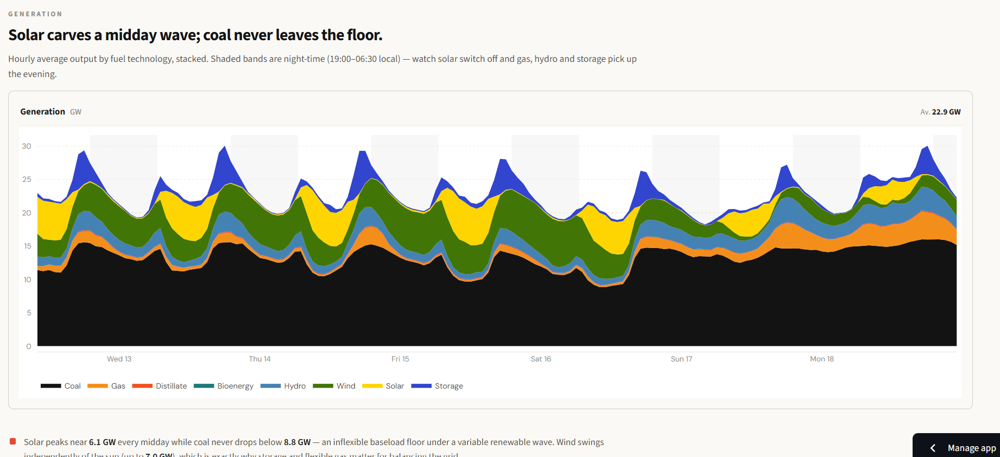
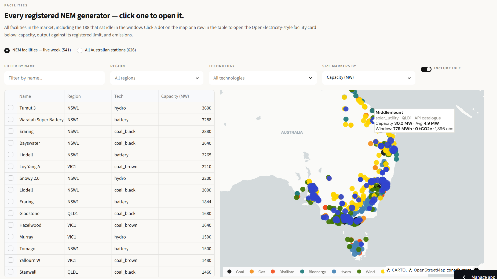
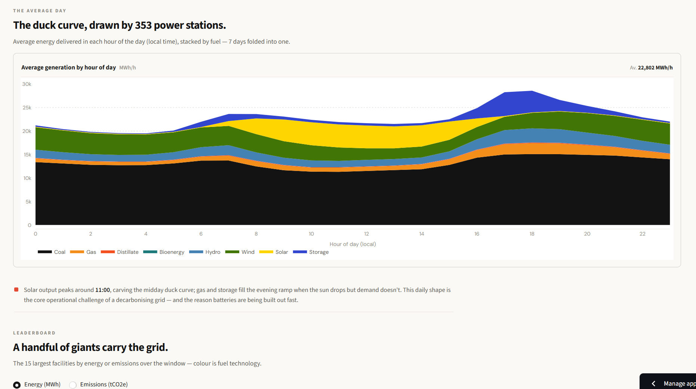
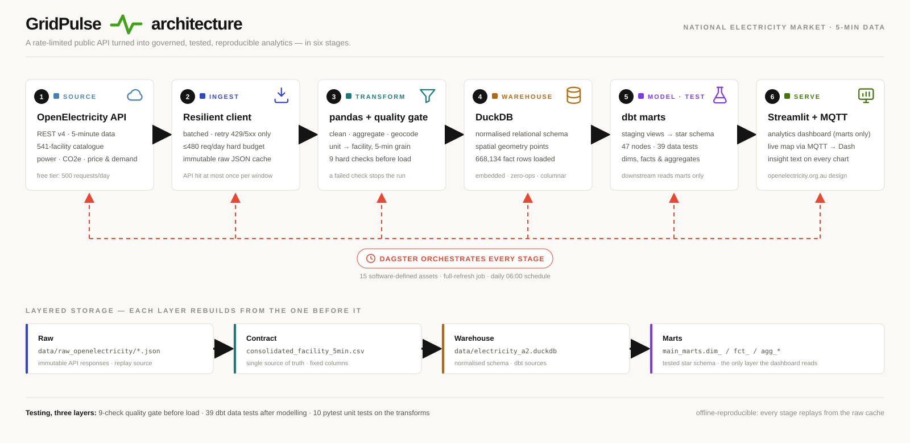

# GridPulse

A data pipeline and dashboard for Australia's National Electricity Market. It pulls
five-minute generation and emissions data for every registered facility, cleans and
warehouses it, models it with dbt, and serves the result as an interactive dashboard.

**Live dashboard: https://gridpulse-nem-analytics.streamlit.app/**

The sample window covers 12 to 18 May 2026: 668,134 readings from 541 registered
facilities across all five NEM regions. The finding that drives most of the dashboard
is that coal supplies around 58% of the energy but roughly 95% of the emissions.

This started as a COMP5339 (Data Engineering, University of Sydney) assignment and
grew into a fuller project, with an installable package, Dagster orchestration, a dbt
warehouse with data tests, and a unit test suite.

## The dashboard

**Overview.** The week at a glance: KPI tiles, the seven-day generation stack by fuel,
and the split between where energy comes from and where carbon comes from.

**Facilities.** Every registered generator on a map, coloured by fuel group and sized
by capacity, power, energy or emissions. Filter by name, region or technology, or
switch on the 188 stations that sat idle during the window. Clicking a marker drills
into that facility's five-minute week against its registered capacity.

**Analysis.** Energy, carbon intensity and renewable share across the five regions;
the diurnal duck curve, with seven days folded into one average day; and a leaderboard
of the 15 facilities carrying the grid.

**About.** The architecture diagram and a stage-by-stage walkthrough, so the pipeline
can be read without leaving the app.

Alongside the marts dashboard, the original MQTT and Plotly Dash map
(`Assignment2_Dashboard_Group156.ipynb`) replays the live stream.

Every number on every page reads from the tested dbt marts, never from raw data.

## How it works

`python -m gridpulse.pipeline` rebuilds every artefact from a committed raw-JSON
cache, so the warehouse reproduces offline with no API key. `dbt build` then models
and tests it, and Dagster wraps both as a single asset graph on a daily schedule.

A few decisions that shaped the build:

- Raw responses are written to disk before parsing and committed to the repo. That
  single choice is what lets the pipeline replay offline.
- The API client retries only transient failures (429 and 5xx, honouring
  `Retry-After`), fails fast on 4xx, and batches around 25 facility codes per call, so
  roughly 430 facilities cost about 18 requests against a free-tier limit of 500 a day.
- Parallel generating units are summed to facility level, since power and emissions
  are both additive across units.
- Nine quality checks run before load rather than after: row count, schema contract,
  non-null keys, unique (interval, facility) grain, region domain, in-window
  timestamps, non-negative emissions, coordinates in range. Negative *power* is kept
  on purpose, because batteries charge.
- Missing or invalid coordinates are backfilled offline from NEM-region centroids and
  tagged with their source, seeding a DuckDB `GEOMETRY` column.
- Testing sits in two layers: the Python quality gate, plus 39 dbt data tests
  (`unique`, `not_null`, `relationships`, `accepted_values`, `accepted_range` and two
  custom singular tests) guarding the marts.

More detail in [docs/ARCHITECTURE.md](docs/ARCHITECTURE.md), with the schema in
[docs/data_dictionary.md](docs/data_dictionary.md).

## Results

Everything here is reproduced by `dbt build` and a query against DuckDB:

- 3.62 TWh of energy and 2.15 Mt of CO2e over the window.
- No nulls across the consolidated contract; 9 of 9 quality checks and 39 of 39 dbt
  tests pass.
- Fossil fuels account for about 64% of energy and close to 100% of emissions, with
  coal alone at ~58% and ~95% respectively.
- NSW1 (1.20 TWh) and QLD1 (1.09 TWh) lead on energy. VIC1 is the dirtiest grid at
  0.767 tCO2e/MWh on brown coal, while hydro-powered TAS1 is 60 times cleaner at
  0.013.
- Solar peaks between roughly 09:00 and 15:00 local, carving out the midday duck
  curve, while coal holds a flat baseload floor and gas and storage cover the evening
  ramp.

## Report

The full write-up, covering data sourcing, methodology, the five-stage architecture,
data-quality strategy, dbt modelling, orchestration and results, is in
[GridPulse_Report.pdf](GridPulse_Report.pdf), built from
[`report/gridpulse.tex`](report/gridpulse.tex).

## Stack

Python 3.12, DuckDB, dbt (dbt-duckdb), Dagster, pandas, Streamlit, Plotly, MQTT
(paho), Dash, pytest.

## Data and limitations

Data comes from the [OpenElectricity](https://openelectricity.org.au/) v4 API for the
National Electricity Market, snapshot window 12 to 18 May 2026, licensed
[CC BY 4.0](https://creativecommons.org/licenses/by/4.0/). The raw JSON cache is
committed; the DuckDB warehouse and consolidated CSV are derived and rebuilt by one
command.

The figures describe one seven-day window in one market, so they are a snapshot rather
than long-run averages. Reported values are operational metering aggregated to
five-minute facility intervals, not audited settlement data.

## Next steps

Incremental dbt models and partitioned Parquet for multi-week history, a short-horizon
price and emissions forecast as a new mart, and CI running pytest and `dbt build` on
every push.

## License

Code is released under the [MIT License](LICENSE). Electricity data comes from
[OpenElectricity](https://openelectricity.org.au/) under CC BY 4.0.

Authors: Aditya Moon and Pranjal Desai.
